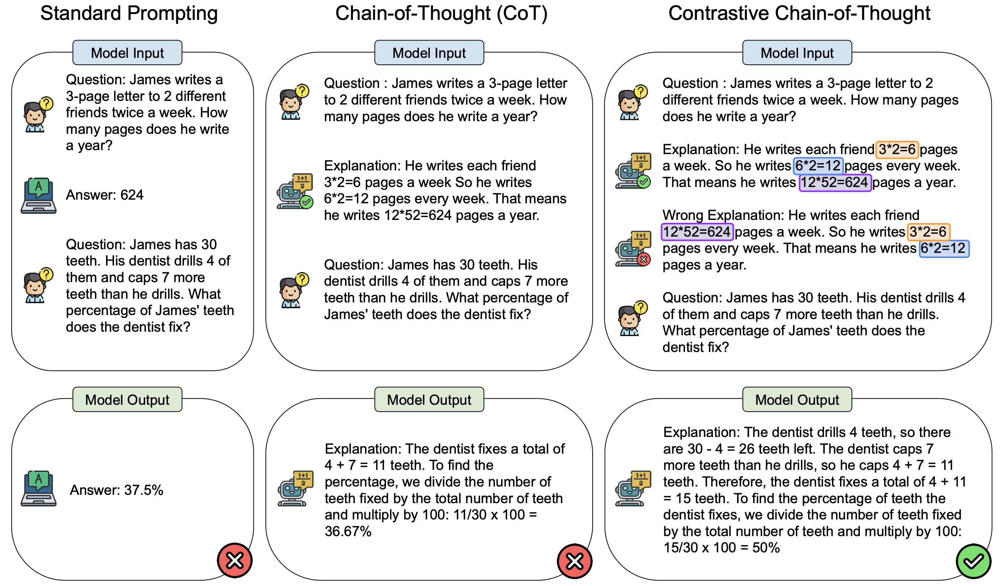

# Contrastive Chain-of-Thought Prompting

[](https://arxiv.org/abs/2311.09277)

This repository implements our work on [Contrastive Chain-of-Thought Prompting](https://arxiv.org/abs/2311.09277). Code release coming soon!



### Abstract
Despite the success of chain of thought in enhancing language model reasoning, the underlying process remains less well understood. Although logically sound reasoning appears inherently crucial for chain of thought, prior studies surprisingly reveal minimal impact when using invalid demonstrations instead. Furthermore, the conventional chain of thought does not inform language models on what mistakes to avoid, which potentially leads to more errors. Hence, inspired by how humans can learn from both positive and negative examples, we propose contrastive chain of thought to enhance language model reasoning. Compared to the conventional chain of thought, our approach provides both valid and invalid reasoning demonstrations, to guide the model to reason step-by-step while reducing reasoning mistakes. To improve generalization, we introduce an automatic method to construct contrastive demonstrations. Our experiments on reasoning benchmarks demonstrate that contrastive chain of thought can serve as a general enhancement of chain-of-thought prompting.

### Reference

```
@misc{chia2023contrastive,
    title={Contrastive Chain-of-Thought Prompting},
    author={Yew Ken Chia and Guizhen Chen and Luu Anh Tuan and Soujanya Poria and Lidong Bing},
    year={2023},
    eprint={2311.09277},
    archivePrefix={arXiv},
    primaryClass={cs.CL}
}
```